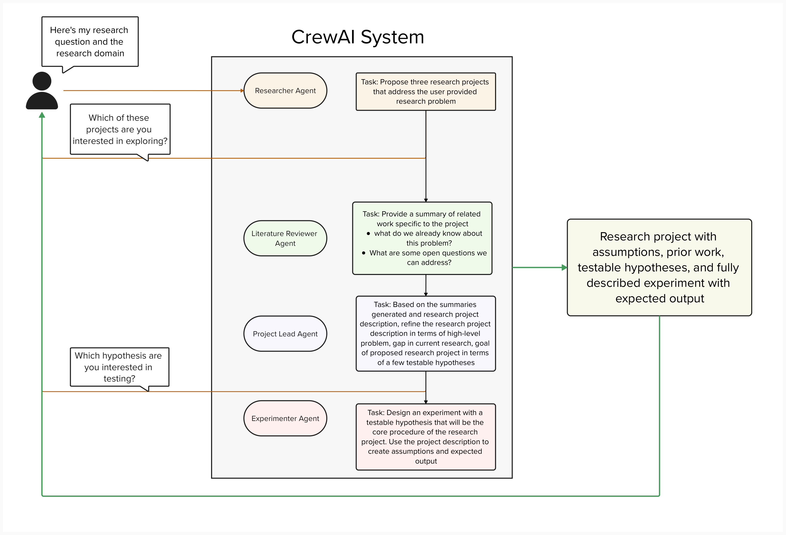

# Research Assistant Crew

### This is a CrewAI agent system set up to assist a researcher with defining research projects and hypotheses for a specific high-level research question. 

## Architecture Diagram 
The following is the proposed architecture of the system that is in progress.

## Initial plan of implementation

The user first provides a high level research question that they would like to study and the domain of the study.

The **researcher agent** first suggests research projects based on the question and the domain provided. The researcher then gets to choose which project they want to explore further.

The **literature reviewer agent** reviews existing literature in the domain to identify existing work, and the open questions in the field.

The **project lead agent** uses this information to further refine and describe the research project in terms of assumptions, the gap in existing research, and the hypotheses that need to be tested.

Once the user chooses which hypothesis they want to test, the **experimenter agent** designs an experimental procedure to test this hypothesis.

## How to run
In the topmost folder, run the command **crewai run**.

## Open Questions
1. Design constraint: Access to academic literature is restricted because many papers sit behind paywalls. 
    - Current workaround: Prioritize open-access papers (arXiv, author-hosted PDFs).

