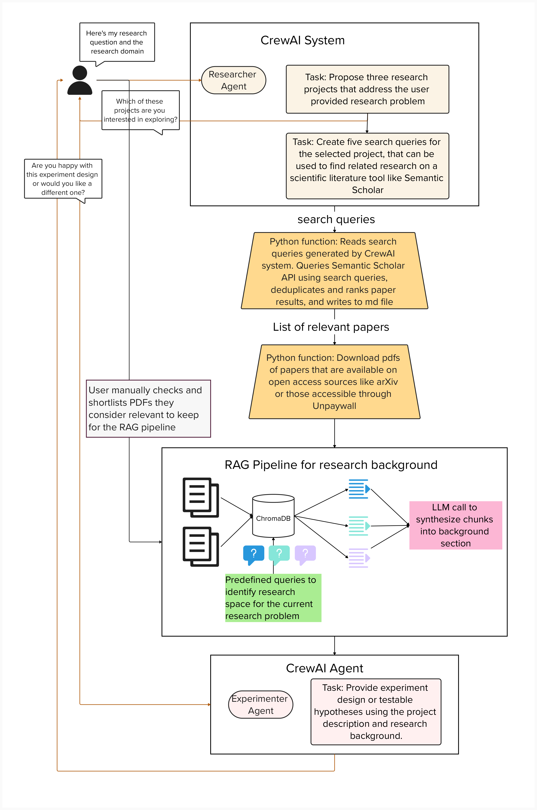

# Research Assistant Crew

### This is a AI agent system built with CrewAI, Python and LLMs set up to assist a researcher with defining research projects and hypotheses for a specific high-level research question. 

## Architecture Diagram 
The following is the proposed architecture of the system.

## Current plan of implementation

The user provides a high-level research question and domain. From there, the system runs through four stages:
1. **Project Scoping** — A researcher agent proposes candidate research projects based on the input. The user selects one to pursue.

2. **Literature Search** — The agent generates targeted search queries for the selected project. These queries are run against Semantic Scholar's API to retrieve a list of relevant papers. The following pipeline then downloads any open-access versions of those papers via arXiv and Unpaywall. The user reviews the retrieved papers and selects which ones to carry forward to the next stage.

3. **Background Synthesis** — Downloaded papers are chunked and embedded into a ChromaDB vector store. Predefined queries probe the research space, and the retrieved context is passed to an LLM to synthesize a structured background section.

4. **Hypothesis Generation** — An experimenter agent proposes a research hypothesis or experimental design grounded in the generated background and the research project description. The user can iterate on this with feedback, prompting the agent to refine or regenerate its output.

## How to run
In the topmost folder, run the command **crewai install** to lock and install the dependencies. Then run **crewai run**.

